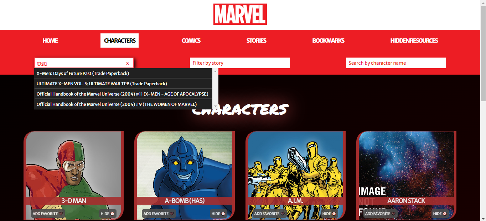
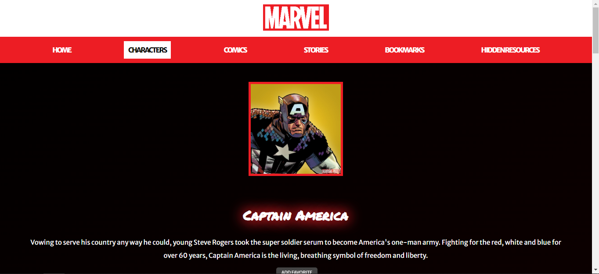

# MARVEL APP

This project consists of a Marvel application where you can search for characters, comics, and stories. You can filter them and search for more details about each of them.

## Description

This application is capable of rendering character, comic, and story cards and providing details for each of them. It also includes pagination, navigation, a search bar, and selection elements to filter them. Additionally, you can add items to a bookmark section, and you have the option to hide certain resources. This project includes tests.

## Technologies

This project was built using TypeScript, React, SASS, React Router Dom, Jest and Testing Library.

## Screenshots

## How to try it locally

The first step is to clone the project and install dependencies with `npm install`.  
 
Then create an `.env` file in the root of the project and add the following enviroments variables:  
 
`REACT_APP_API_KEY` 
 
`REACT_APP_HASH` 
 
`REACT_APP_API_ENDPOINT` 
 
You can obtain the values of these variables from the <a href='https://developer.marvel.com/'>Marvel API</a>. 
 
Now you are ready to execute the command `npm start` and see the project in the localhost.

## Deploy

You can visit the deployed project <a href='https://marvelapp-nicolasmilitello.vercel.app/'>here</a>.

# ABOUT ME

## Portfolio

You can visit my portfolio to see other projects I have worked on <a href='https://portfolio-nicolasmilitello.vercel.app/'>here</a>.

## Contact

You can find more about me in my LinkedIn profile <a href='https://www.linkedin.com/in/nicolas-militello-full-stack/'>here</a>.
